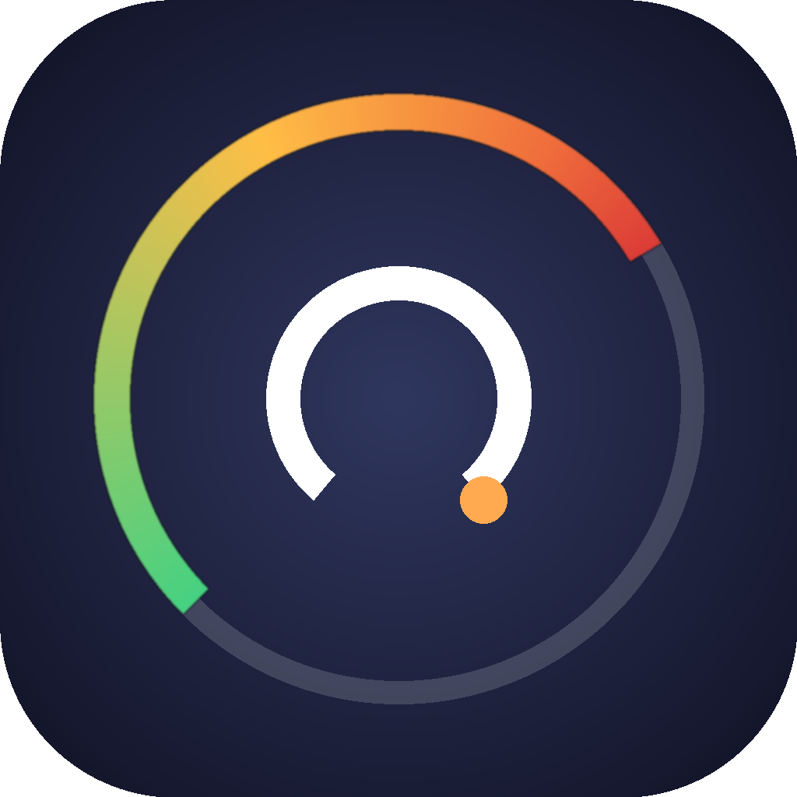

<p align="center">
  
</p>

# ClaudeStats

A native macOS menu bar app that shows your Claude Code usage at a glance — with a **pace-aware** indicator that tells you whether you're burning through your 5-hour and weekly limits faster or slower than a steady budget.

Built in pure SwiftUI. No Dock icon, no telemetry, no background services.

---

## What you see

**Menu bar item**
- A tortoise / gauge / hare glyph indicating whether you're under, on, or over pace
- Configurable display: % used, % remaining, time to reset, or icon only
- Compact mode hides the glyph for a minimal footprint
- If no 5h data is available yet (e.g. cold start), shows hourglass + your weekly percentage
- If not signed in, shows a question-mark icon + "ClaudeStats" — clicking it goes straight to Settings

**Popover** (click the menu bar item)
- **5-hour window** section with a pace bar: a colored fill shows how much of your window budget you've consumed, and a vertical marker shows where you should be based on elapsed time. If the fill is left of the marker you're ahead of budget; right of it, you're burning fast.
- **Weekly** section with the same pace visualization for your 7-day cap
- **Activity heatmap** — GitHub-style contribution grid showing the last 8 weeks of daily usage intensity (togglable in Settings, requires restart to apply)
- Per-model breakdown (opus / sonnet / haiku) as share of the window's total
- Projected end-of-window utilization
- Countdown to next reset and live refresh countdown

**Settings** (Settings button in the popover)
- Sign in to Claude.ai via email (embedded WKWebView), Google (`ASWebAuthenticationSession` in your default browser), or paste your `sessionKey` manually
- **Menu bar display** — choose between: % used (default), % remaining, time to reset, or icon only
- **Compact menu bar** — hides the pace glyph, showing only the text value. Automatically disabled when "Icon only" is selected.
- **Global keyboard shortcut** — set a hotkey to toggle the popover from anywhere. Uses the Carbon `RegisterEventHotKey` API — no Accessibility permissions required.
- **Show activity heatmap in popover** — toggles the inline heatmap; change requires a restart (the app will prompt you).
- **Desktop overlay** — pin a translucent, non-interactive widget with your pace data, activity heatmap, and a watermark pace glyph to any corner of any screen. Respects Dock placement and repositions instantly when the Dock shows/hides.
- Toggle Launch at Login
- **Check for updates** — queries the GitHub Releases API; if a newer version is available you can **Install & restart** in-place. Works whether the app lives in `/Applications/` or anywhere else.
- **Check for updates automatically at startup** — when enabled, the app checks for a newer release each launch and shows a native macOS confirmation dialog (Update now / Later) before installing.

**Usage History** (History button in the popover footer)
- **Streak tracker** — consecutive days of Claude usage and total active days in the last 90 days
- **Last 7 days** — bar chart of daily billable token usage with color-coded intensity
- **Usage heatmap** — full 12-week GitHub-style contribution grid with month labels, weekday labels, and tooltips

**About** (About button in the popover footer)
- App icon, current version, author, contact email, project URL, and license link.

---

## How it works

When you sign in to Claude.ai through the app, it calls Anthropic's own undocumented but browser-accessible endpoint:

```
GET https://claude.ai/api/organizations/{orgId}/usage
```

This is the exact endpoint used by Claude's in-page `/usage` view. It returns your real 5-hour and 7-day utilization percentages plus actual reset timestamps, straight from Anthropic. No guessing, no local approximation.

Your `sessionKey` cookie is stored in your app preferences plist. Cleared when you sign out.

**Per-model breakdown** comes from parsing your local Claude Code session logs at `~/.claude/projects/*/*.jsonl` — the `/usage` endpoint returns aggregate percentages only, not a per-model split. Internal Claude Code messages tagged `<synthetic>` (tool-result wrappers, session-interrupted notices) are filtered out so the percentages reflect only real API calls.

**Refresh cadence:** every 30 seconds. Manual refresh via the Refresh button.

---

## System requirements

- **macOS 14 Sonoma** or later (uses `MenuBarExtra`, `@Observable`, `openSettings` environment action)
- Apple Silicon or Intel (universal binary)
- A paid Claude subscription (Pro, Max 5×, or Max 20×) — the app doesn't support Free or API-key-only accounts
- Claude Code installed locally — used for the per-model breakdown via `~/.claude/projects/`

---

## Installation

**Grab the built app:**
```sh
cp -R build/ClaudeStats.app /Applications/
open /Applications/ClaudeStats.app
```

First launch may prompt Gatekeeper because the app is ad-hoc signed. Right-click the app in Finder → **Open** → **Open** in the dialog. You only have to do this once.

**Launch at login** only works reliably when the app lives in `/Applications/` — `SMAppService` registers against the app bundle path.

---

## Building from source

Requirements:
- Xcode 15+ (for the Swift 5.9 toolchain)
- Python 3 with Pillow (only if regenerating the icon: `pip install Pillow`)

```sh
# Build a release binary and assemble the .app bundle
./scripts/build-app.sh

# Regenerate the app icon (optional)
python3 scripts/make-icon.py
```

The build script:
1. Runs `swift build -c release` (arm64 + x86_64 when possible, falls back to host arch)
2. Assembles `build/ClaudeStats.app` with `Info.plist`, binary, and icon
3. Ad-hoc codesigns the bundle (required for `SMAppService` to work)

---

## Signing in

Inside the app, open **Settings** to sign in.

**Supported login methods:**
- **Google** — uses `ASWebAuthenticationSession`, which opens your default browser (Safari, Chrome, Edge, etc.) for OAuth. Google can't block this because it's a real browser, not an embedded web view. After login, the app polls `HTTPCookieStorage` to auto-capture the `sessionKey` cookie. If auto-capture fails, you'll be prompted to paste the cookie manually.
- **Email** — opens an embedded WKWebView at `claude.ai/login`. Magic link won't work inside the embedded window, but if your browser session is already authenticated via the same cookie, you may not need to log in again.
- **Manual cookie paste** — expand "Paste sessionKey manually" in Settings (always works as a fallback).

**Manual paste flow:**
1. Open claude.ai in Safari or Chrome while logged in
2. DevTools (⌥⌘I) → Application → Cookies → `https://claude.ai`
3. Copy the value of the `sessionKey` cookie
4. Paste into the app's Settings

The app then fetches your organization ID automatically and starts polling `/usage`.

---

## Privacy

- All data stays on your Mac. No external services apart from claude.ai itself.
- Your session cookie is stored locally in the app's UserDefaults plist (`~/Library/Preferences/name.horta.albert.ClaudeStats.plist`).
- No analytics, no telemetry, no crash reporting.
- Source is all in this repo — audit it.

---

## Known limitations

- **Claude.ai session endpoint is undocumented.** It could change shape or disappear at any time; if that happens the pace sections will simply go blank until the app is updated.
- **Weekly Opus cap is not separately shown.** Anthropic tracks it internally but the `/usage` endpoint doesn't return it, so the weekly bar represents the combined 7-day limit.
- **Sign-in is required.** Without a claude.ai session the pace sections have no data to show.

---

## Project layout

```
ClaudeStats/
├── Package.swift                       swift-tools-version 5.9, macOS 14
├── Resources/
│   ├── Info.plist                      LSUIElement=true, bundle metadata
│   └── AppIcon.icns                    generated by scripts/make-icon.py
├── Sources/ClaudeStats/
│   ├── App.swift                       @main entry, MenuBarExtra, AppDelegate
│   ├── Core/
│   │   ├── JsonlUsageReader.swift      Streams ~/.claude/projects/*/*.jsonl for per-model split
│   │   ├── StatsStore.swift            Observable store, pace math, remote refresh
│   │   ├── Scope.swift                 UsageScope enum (5h, Week)
│   │   ├── Keychain.swift              Thin UserDefaults shim (misnomer kept)
│   │   ├── ClaudeAIClient.swift        GET /api/organizations/{id}/usage
│   │   ├── UpdateChecker.swift         GitHub Releases API check
│   │   ├── UpdateInstaller.swift       Self-update: download zip, swap bundle, relaunch
│   │   ├── LaunchAtLogin.swift         SMAppService wrapper
│   │   ├── HotkeyManager.swift        Carbon RegisterEventHotKey global shortcut
│   │   └── UsageHistory.swift         Daily summaries, streak calculation, heatmap data
│   └── UI/
│       ├── PopoverView.swift           Main popover layout + PaceView + MiniHeatmapGrid
│       ├── HistoryView.swift           Usage History window (bar chart, heatmap, streak)
│       ├── SettingsView.swift          Sign-in, display, launch-at-login, updates
│       ├── SignInWindow.swift          WKWebView (email) + ASWebAuthenticationSession (Google)
│       ├── DesktopOverlay.swift        Non-interactive desktop widget + overlay manager
│       └── AboutWindow.swift           About panel
└── scripts/
    ├── build-app.sh                    swift build → .app bundle → codesign
    └── make-icon.py                    Pillow-generated AppIcon.icns
```

---

## Credits

- The `/api/organizations/{orgId}/usage` endpoint and its response shape were identified by studying [she-llac/claude-counter](https://github.com/she-llac/claude-counter), a MIT-licensed browser extension that does the same thing in the browser. Huge thanks.

---

## License

ClaudeStats is licensed under the **MIT License**. See [`LICENSE`](./LICENSE) for the full text.

This project incorporates knowledge derived from [she-llac/claude-counter](https://github.com/she-llac/claude-counter) — specifically its identification of the `/api/organizations/{orgId}/usage` endpoint and response shape. `claude-counter` is also MIT-licensed.
